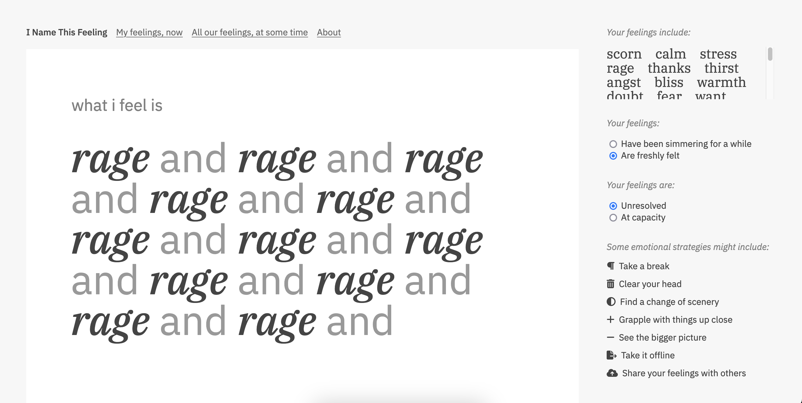

# I Name This Feeling

A tool for writing poetry by giving names to your feelings.



## Development

This is a Node.js/Express app using EJS as the templating engine. It also interfaces with a Supabase database — to get that running, make a copy of `.env.example`, rename it `.env`, and add the API key from the Supabase project key.

```
npm install
npm run dev
```